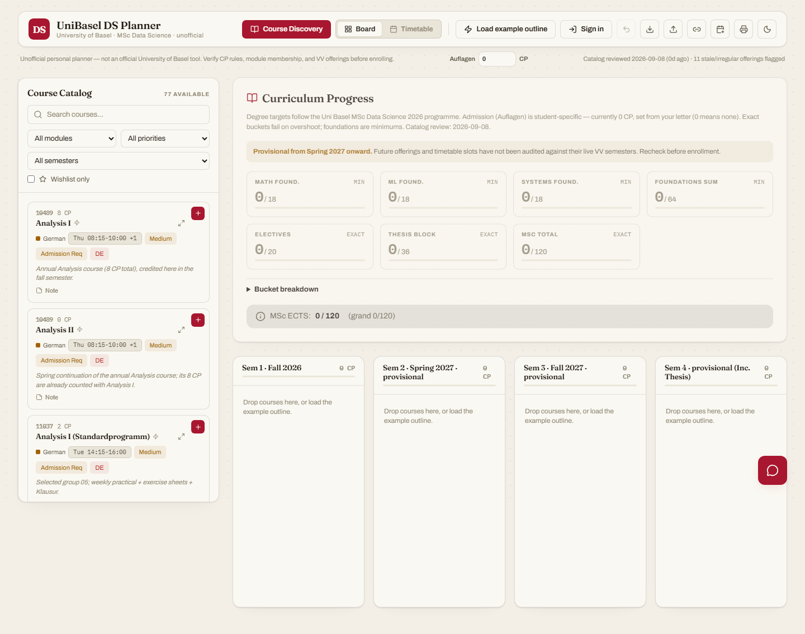
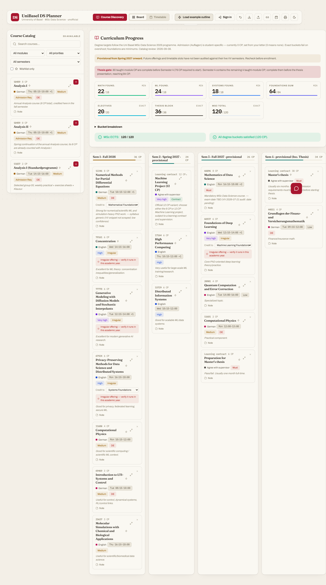
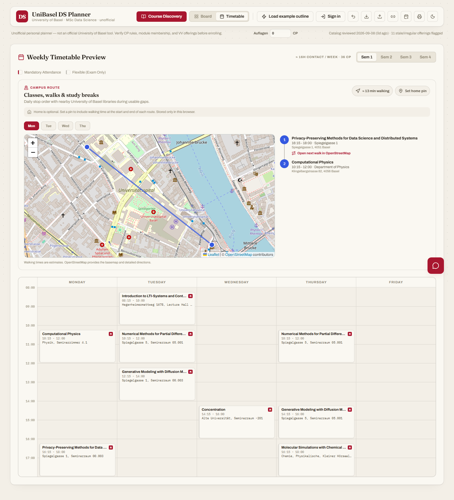
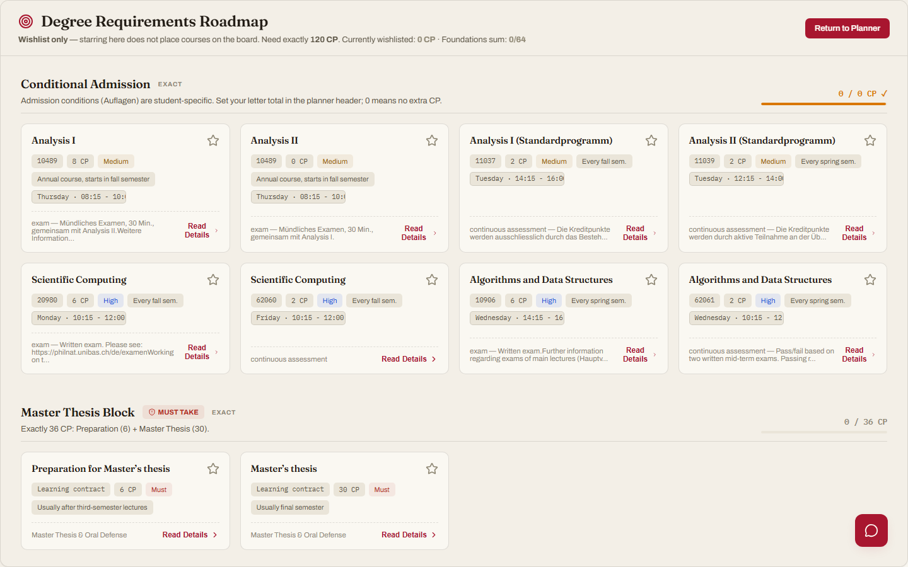
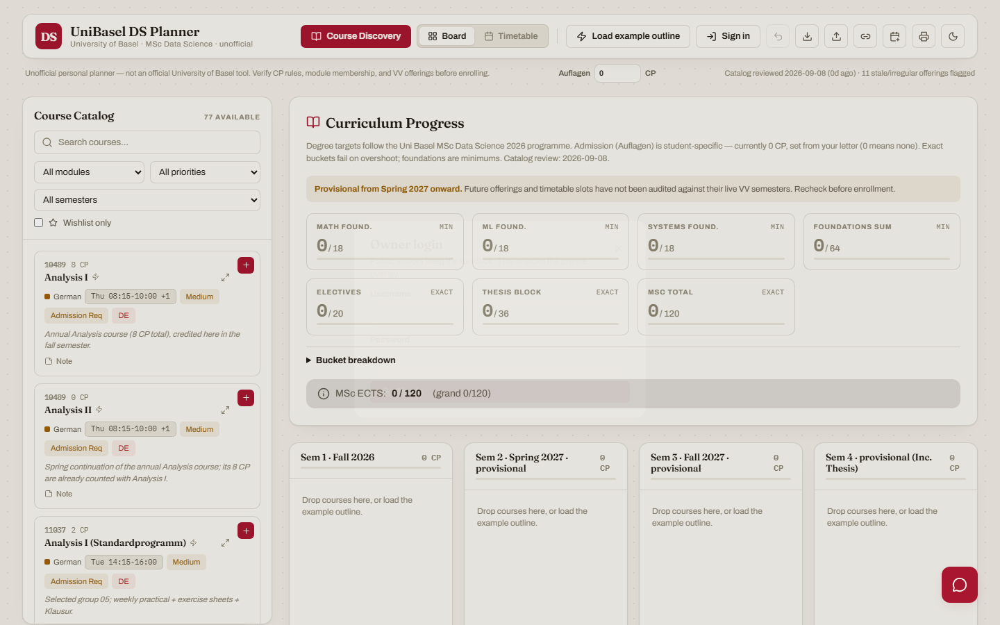

# UniBasel DS Planner

Unofficial **University of Basel MSc Data Science** curriculum planner.

Short handle: **BaselCal** (`baselcal.vercel.app`). The longer name is for search — people looking for Uni Basel, MSc Data Science, ECTS, or Vorlesungsverzeichnis.

Plan four semesters, check official 2026 credit rules, spot timetable clashes, and export ICS / JSON. This is **not** an official University of Basel tool. Always verify CP rules, module membership, and offerings in the [Vorlesungsverzeichnis](https://vorlesungsverzeichnis.unibas.ch) before you enrol.

Live demo: [baselcal.vercel.app](https://baselcal.vercel.app)

The public demo is a **sandbox**. Anyone can drag courses, load the example outline, and export a plan. Owner login (no signup) unlocks a private overlay stored in Vercel env vars — that JSON is **not** shipped in the client bundle.

<p align="center">
  
</p>

| Board with example outline | Timetable |
|---|---|
|  |  |

| Course discovery | Owner login |
|---|---|
|  |  |

Refresh screenshots with `DOCS_SHOTS=1 npx playwright test tests/docs-shots.spec.ts`.

## Quick start

```bash
npm install
npm run dev
```

Dev server: `http://localhost:5179`

The board starts empty. Drag courses from the catalog, or click **Load example outline** for a sample 120 CP Master’s plan (no admission / Auflagen courses).

## Your personal details stay local

Admission conditions (Auflagen), your real plan, and an optional home pin are **not** part of the public default.

1. Copy the example config:

   ```bash
   cp config/student.example.json config/student.local.json
   ```

2. Edit `config/student.local.json`:
   - `admissionTarget` — CP from your Zulassungsbescheid (`0` if none)
   - `seedPlan` — `true` to fill the board on first visit
   - `plan` / `allocations` — course IDs per semester
   - `home` — optional map pin (`lat` / `lng`); leave null to set it in the browser

3. Restart `npm run dev`. The file is gitignored.

On Vercel, keep `STUDENT_CONFIG` as a **server** env var (used only by `/api/unlock`). Also set `PLANNER_USER` and `PLANNER_PASSWORD`. Do not commit them. Public builds never bake that JSON into JavaScript.

You can also change **Auflagen CP** in the header at any time; that value is stored only in this browser.

## Accuracy checks

```bash
npm run validate               # catalog CP rules + example outline + time/room vs VV snapshot
npm run validate:details       # title, CP, times, rooms vs saved VV snapshots
npm run validate:details:live  # same checks against live Vorlesungsverzeichnis
npm run validate:details:plan  # only example outline + local student plan
npm run audit:modules          # refresh the Fall 2026 module-tree snapshot
npm run refresh:catalog        # scrape every catalog VV page and apply times/rooms
npm run audit:catalog          # scrape every catalog VV page, snapshot only
npm test
npm run build
```

## Degree rules

Official MSc Data Science 2026 targets (see `degree_rules.json`):

| Bucket | Rule |
|--------|------|
| Mathematical Foundations | min 18 CP |
| Machine Learning Foundations | min 18 CP |
| Systems Foundations | min 18 CP |
| Foundations combined | min 64 CP |
| Electives in Data Science | exactly 20 CP |
| Thesis block | exactly 36 CP |
| Master's total | exactly 120 CP |
| Admission (Auflagen) | **your letter** (default 0) |

Grand total = 120 + admission. Exact buckets fail on overshoot.

## Docs

- [CONTRIBUTING.md](CONTRIBUTING.md)
- [DATA.md](DATA.md) — catalog and VV sources
- [agent.md](agent.md) — domain rules for contributors

## License

[MIT](LICENSE)
